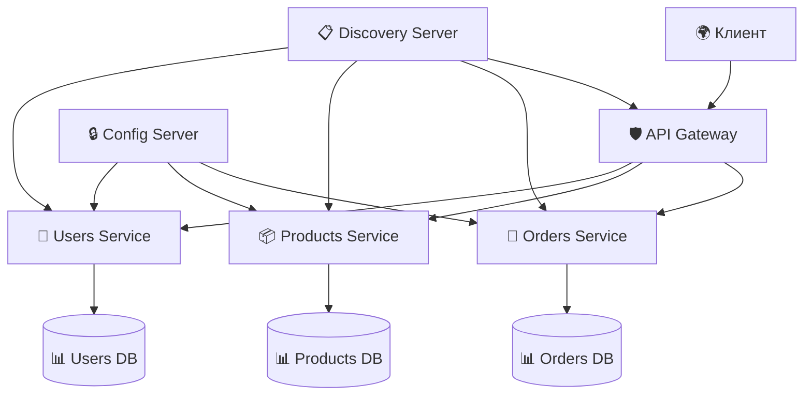

# 🌐 Spring Cloud Microservices 🚀

[](https://spring.io/projects/spring-boot)
[](https://spring.io/projects/spring-cloud)

Современная микросервисная архитектура, построенная на экосистеме Spring Cloud. Этот проект демонстрирует лучшие практики создания распределенных систем.

## 📦 Состав проекта

### Основные сервисы:
- **🛡️ api-gateway** - Единая точка входа для всех запросов (Spring Cloud Gateway)
- **🔒 config-server** - Централизованное управление конфигурациями (Spring Cloud Config)
- **📋 discovery-server** - Регистрация и обнаружение сервисов (Eureka Server)
- **🔄 orders-service** - Сервис управления заказами
- **📦 products-service** - Сервис каталога продуктов
- **👥 users-service** - Сервис управления пользователями

### Вспомогательные сервисы:
- **📊 monitoring** - Мониторинг и метрики (Micrometer, Prometheus, Grafana)

## 🏗️ Архитектура



## 🚀 Быстрый старт

### Предварительные требования:
- Java 21+
- Maven 3.6+
- Docker-compose

### Запуск в development режиме:

1. **Клонируйте репозиторий:**
```bash
git clone https://github.com/DKAVrZoV65F/spring-cloud-microservices.git
cd spring-cloud-microservices
```

2. **Запустите основные сервисы:**
```bash
# Запуск discovery server
cd discovery-server
mvn spring-boot:run

# Запуск config server
cd ../config-server
mvn spring-boot:run

# Запуск api gateway
cd ../api-gateway
mvn spring-boot:run

# Запуск бизнес-сервисов
cd ../orders-service
mvn spring-boot:run
```

## 🛠️ Технологии

- **Java 21** - Основной язык разработки
- **Spring Boot 3** - Фреймворк для создания сервисов
- **Spring Cloud** - Инструменты для микросервисов
- **Eureka** - Service discovery
- **Spring Cloud Gateway** - API Gateway
- **Spring Cloud Config** - Централизованная конфигурация
- **Docker** - Контейнеризация
- **Maven** - Сборка проекта

## 📡 API Endpoints

| Сервис | URL | Описание |
|--------|-----|----------|
| Discovery | http://localhost:8761 | 📋 Eureka Dashboard |
| Gateway | http://localhost:8080 | 🛡️ API Gateway |
| Orders | http://localhost:8080/orders | 🔄 Orders API |
| Products | http://localhost:8080/products | 📦 Products API |
| Users | http://localhost:8080/users | 👥 Users API |

## 🔧 Конфигурация

Настройки приложений хранятся в config-server и могут быть изменены без перезапуска сервисов. Поддерживаются профили:
- `development` - для разработки
- `production` - для production среды

## 📈 Мониторинг

Проект включает в себя систему мониторинга на основе:
- ✅ Spring Boot Actuator
- ✅ Micrometer metrics
- ✅ Prometheus (опционально)
- ✅ Grafana dashboard (опционально)

## 🤝 Contributing

Мы приветствуем вклад в проект! Пожалуйста, следуйте этим шагам:

1. Форкните репозиторий
2. Создайте feature branch (`git checkout -b feature/AmazingFeature`)
3. Закоммитьте изменения (`git commit -m 'Add some AmazingFeature'`)
4. Запушьте branch (`git push origin feature/AmazingFeature`)
5. Откройте Pull Request

---

## 📄 Лицензия

Этот проект создан в учебных целях.
